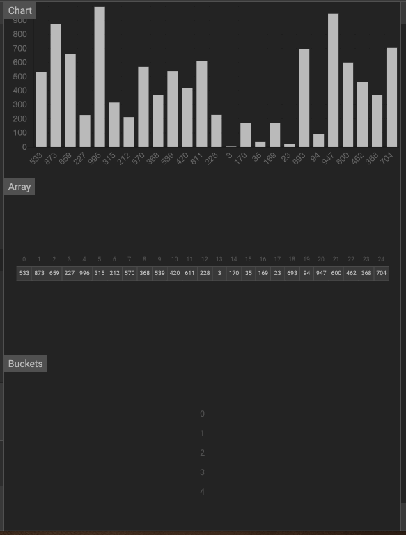

# 桶排序

桶排序（Bucket Sort）是计数排序的升级版。它利用了函数的映射关系，高效与否的关键就在于这个映射函数的确定。
它将数组分割成若干个小区间，称为桶，然后每个桶再分别排序，最后按照顺序将各个桶中的元素依次取出，即可得到排好序的数组。它是一种分布式排序算法
# 图解



# 代码实现

```js
/*
    桶排序  时间：O(n + k)  空间: O(n + k)
    思路：
    1. 设置一个定量的数组当作空桶；
    2. 遍历输入数据，并且把数据一个一个放到对应的桶里去；
    3. 对每个不是空的桶进行排序；
    4. 从不是空的桶里把排好序的数据拼接起来。 

    注意，桶排序不是比较排序，它是通过创建和分配数据到桶中来实现排序。
*/
function bucketSort(arr, bucketSize = 5) {
  if (arr.length === 0) {
    return arr;
  }

  let i;
  let minValue = arr[0];
  let maxValue = arr[0];
  for (i = 1; i < arr.length; i++) {
    if (arr[i] < minValue) {
      minValue = arr[i]; // 输入数据的最小值
    } else if (arr[i] > maxValue) {
      maxValue = arr[i]; // 输入数据的最大值
    }
  }

  // 桶的初始化
  let bucketCount = Math.floor((maxValue - minValue) / bucketSize) + 1;
  let buckets = new Array(bucketCount);
  for (i = 0; i < buckets.length; i++) {
    buckets[i] = [];
  }

  // 利用映射函数将数据分配到各个桶中
  for (i = 0; i < arr.length; i++) {
    buckets[Math.floor((arr[i] - minValue) / bucketSize)].push(arr[i]);
  }

  arr.length = 0;
  for (i = 0; i < buckets.length; i++) {
    insertionSort(buckets[i]); // 对每个桶进行排序，这里使用了插入排序
    for (let j = 0; j < buckets[i].length; j++) {
      arr.push(buckets[i][j]); 
    }
  }

  return arr;
}

// 插入排序
function insertionSort(arr) {
  let len = arr.length;
  let preIndex, current;
  for (let i = 1; i < len; i++) {
    preIndex = i - 1;
    current = arr[i];
    while (preIndex >= 0 && arr[preIndex] > current) {
      arr[preIndex + 1] = arr[preIndex];
      preIndex--;
    }
    arr[preIndex + 1] = current;
  }
  return arr;
}
```